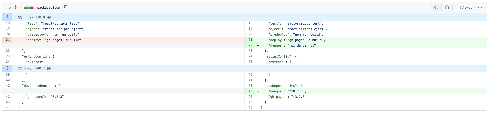
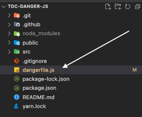
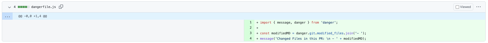
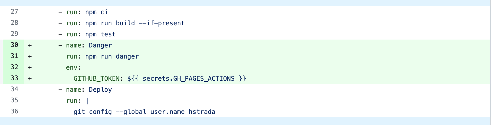

# Criando o projeto

> npx create-react-app tdc-danger-js

## Adicionando o DangerJS como dependência de desenvolvimento

> yarn add danger -D

## Criar arquivo dangerfile.(ts|js)

Criando o arquivo

Exemplo de código

## Adicionando na sua pipeline

